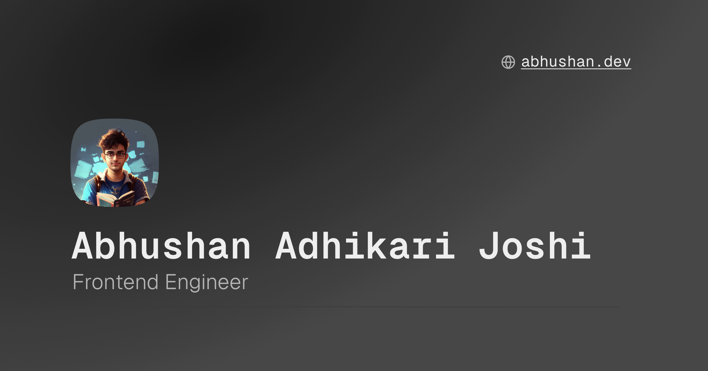

  

# Personal Website

> The website is still Work in Progress (WIP)

My personal website, digital playground and blogging space.

The project is created using the following technologies:

1. [**Astro**](https://astro.build/) as the framework with [React](https://react.dev/) as UI library integration.
2. [**tailwindcss**](https://tailwindcss.com/) as the styling framework.
3. [**Cloudflare**](https://www.cloudflare.com/) for the deplyment through [Cloudflare Pages](https://pages.cloudflare.com/).
4. [**Radix Colors**](https://www.radix-ui.com/colors) for the pallete composition using [CSS Variables](https://developer.mozilla.org/en-US/docs/Web/CSS/Using_CSS_custom_properties).
5. [**Radix UI Primitives**](https://www.radix-ui.com/primitives) as the base layer for build components with accessibility in mind.

The website is inspired from [Lee Robinson](https://leerob.io/) personal website.

## Motivation

So, why did I decide to create my own website?

Well, I figured it's about time to have a cozy corner on the internet to spill the beans on my coding adventures, share what I've learned in my years as a Frontend Developer, and probably crack a tech joke or two. It's all about connecting, learning, and having a good time while we navigate the ever-changing world of code.
